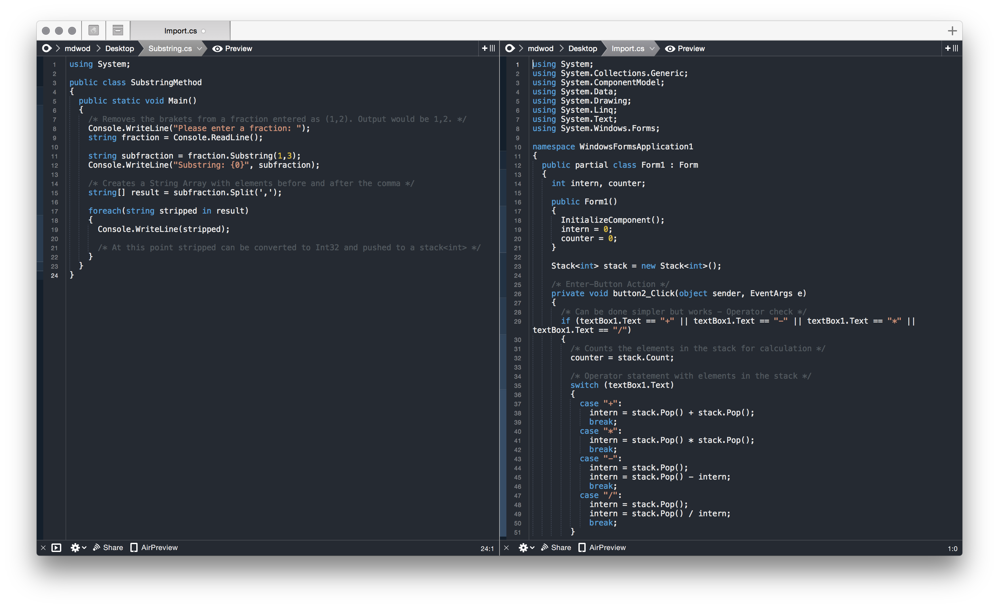

# Coda 2 C# mode

Over the last months I had to write in C# on a OS X machine and found that working with [Mono on OS X](http://www.mono-project.com/docs/about-mono/supported-platforms/osx/) in a IDE and switching back and forth to the terminal to compile it, wasn't comfortable. Since I use [Panics Coda 2](https://www.panic.com/coda/) for other development I knew the split screen mode, which I wanted to use for writing C# and compiling it in the same application.

I found and used the basic layout from [Renaud Gaudins](http://www.codingmonkeys.de/subethaedit/old/modes.html) C# mode. Since it is from 2005 it does not work with the current Coda version (2.5.10). I tweaked it, added some C# syntax and additional some parts from the C# mode from [The Coding Monkeys SubEthaEdit](https://github.com/codingmonkeys/SubEthaEdit/tree/master/Modes), which is not compatible with Coda 2. (I asked them for permission to use and publish it.)

## Additional Information

This mode was hacked together so it still needs some work - Please consider that before installing it. The C# numeric syntax highlight uses the CSS highlight from Coda, so you have to change the CSS numeric color to change the C# numeric color.
